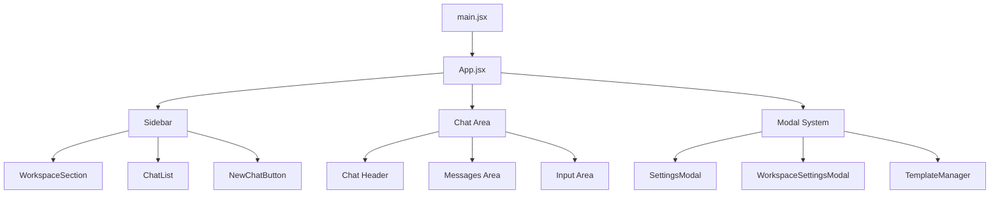

# 🏗️ ChatBot React - Technical Architecture Documentation

## 📋 System Overview

This document provides a comprehensive technical overview of the ChatBot React application architecture, including component structure, data flow, and implementation details.

## 🎯 Architecture Principles

### Design Patterns
- **Component Composition**: Modular components with single responsibilities
- **Custom Hooks**: Logic separation and reusability
- **Unidirectional Data Flow**: Predictable state management
- **Separation of Concerns**: Clear boundaries between UI, logic, and data

### Performance Strategy
- **React.memo**: Preventing unnecessary re-renders
- **useCallback/useMemo**: Optimizing expensive operations
- **Lazy Loading**: Code splitting for optimal bundle size
- **CSS Containment**: Limiting style recalculation scope

## 🗂️ Project Structure Deep Dive

```
d:\DEV\All-Project\AI\ChatBot_react\
├── public/
│   └── vite.svg                 # App icon
├── src/
│   ├── components/              # React components
│   │   ├── Chat/               # Chat interface components
│   │   ├── MessageActions/     # Message interaction toolbar
│   │   │   └── MessageActions.jsx
│   │   ├── PromptTemplateManager/  # Template system
│   │   │   └── PromptTemplateManager.jsx
│   │   ├── Settings/           # Global settings
│   │   │   └── SettingsModal.jsx
│   │   ├── Sidebar/            # Navigation components
│   │   │   ├── ChatList.jsx
│   │   │   ├── NewChatButton.jsx
│   │   │   ├── Sidebar.jsx
│   │   │   ├── WorkspaceInfo.jsx
│   │   │   └── WorkspaceSection.jsx
│   │   ├── TokenUsage/         # Token visualization
│   │   │   └── TokenUsage.jsx
│   │   ├── UI/                 # Shared UI components
│   │   │   ├── CodeBlock.jsx
│   │   │   ├── LazyCodeBlock.jsx
│   │   │   └── LazyMarkdown.jsx
│   │   └── WorkspaceManager/   # Workspace management
│   │       ├── WorkspaceManager.jsx
│   │       └── WorkspaceSettingsModal.jsx
│   ├── hooks/                  # Custom React hooks
│   │   ├── useChats.js         # Chat state management
│   │   ├── useLocalStorage.js  # Storage abstraction
│   │   ├── useSettings.js      # Global settings
│   │   └── useWorkspace.js     # Workspace management
│   ├── services/               # External service integrations
│   │   └── openai.js           # OpenAI API client
│   ├── styles/                 # CSS architecture
│   │   ├── base.css           # Global styles & variables
│   │   ├── chat.css           # Chat interface styles
│   │   ├── components.css     # Legacy component styles
│   │   ├── forms.css          # Form elements
│   │   ├── index.css          # Main entry point
│   │   ├── message.css        # Message bubble styles
│   │   ├── modal.css          # Modal system styles
│   │   ├── settings.css       # Settings modal styles
│   │   ├── sidebar.css        # Sidebar navigation
│   │   ├── template.css       # Template manager styles
│   │   ├── token.css          # Token usage styles
│   │   └── workspace.css      # Workspace components
│   ├── utils/                  # Utility functions
│   │   ├── constants.js       # App configuration
│   │   └── helpers.js         # Helper functions
│   ├── App.css               # App-specific styles
│   ├── App.jsx               # Main application component
│   ├── index.css             # Entry styles
│   └── main.jsx              # Application entry point
├── eslint.config.js           # ESLint configuration
├── index.html                 # HTML template
├── package.json              # Dependencies & scripts
├── postcss.config.js         # PostCSS configuration
├── tailwind.config.js        # Tailwind CSS setup
├── vite.config.js            # Vite build configuration
└── README.md                 # Project documentation
```

## 🧩 Component Architecture

### Core Application Flow



### Component Hierarchy

#### App.jsx (Root Component)
**Purpose**: Application state orchestration and layout management

**Key Responsibilities**:
- Global state management integration
- Modal visibility coordination
- Event handler delegation
- Layout container management

**State Management**:
```javascript
// UI State
const [sidebarCollapsed, setSidebarCollapsed] = useState(false);
const [showSettings, setShowSettings] = useState(false);
const [showWorkspaceSettings, setShowWorkspaceSettings] = useState(false);
const [editingWorkspace, setEditingWorkspace] = useState(null);

// Template State
const [showTemplateManager, setShowTemplateManager] = useState(false);
const [selectedTemplate, setSelectedTemplate] = useState(null);
const [editingTemplate, setEditingTemplate] = useState(null);
```

#### Sidebar Components

##### Sidebar.jsx
**Purpose**: Main navigation container with collapsible functionality

**Features**:
- Resizable sidebar with drag handle
- Collapsible state management
- Workspace and chat navigation
- Footer with action buttons

**Performance Optimizations**:
```javascript
export const Sidebar = memo(function Sidebar({ ... }) {
  // Memoized resize handlers
  const handleMouseDown = useCallback(() => {
    setIsResizing(true);
  }, []);
  
  // Efficient event listeners
  useEffect(() => {
    if (isResizing) {
      document.addEventListener('mousemove', handleMouseMove);
      document.addEventListener('mouseup', handleMouseUp);
      return () => {
        document.removeEventListener('mousemove', handleMouseMove);
        document.removeEventListener('mouseup', handleMouseUp);
      };
    }
  }, [isResizing, handleMouseMove, handleMouseUp]);
});
```

##### WorkspaceSection.jsx
**Purpose**: Workspace navigation and chat organization

**Key Features**:
- Workspace selector dropdown
- Chat list integration
- Workspace settings access
- Empty state handling

##### ChatList.jsx
**Purpose**: Chat navigation with management capabilities

**Features**:
- Chat item rendering with metadata
- Inline editing for chat titles
- Delete confirmation dialogs
- Active chat highlighting
- Search and filter capabilities

#### Chat Interface Components

##### Message Rendering
**Architecture**: Optimized message rendering with lazy loading

```javascript
// Conditional rendering for performance
{currentChat.messages?.filter(msg => msg.content && msg.content.trim()).map((msg, index) => (
  <div key={msg.id || index} className="message-wrapper">
    <div className={`message-container ${msg.role}`}>
      {/* Avatar and timestamp */}
      <div className="message-avatar-wrapper">
        <div className="message-avatar">
          <span className="avatar-icon">{msg.role === 'assistant' ? '🤖' : '👤'}</span>
        </div>
      </div>
      
      {/* Message content with conditional rendering */}
      <div className={`message-bubble ${msg.role}`}>
        {msg.role === 'assistant' ? (
          <LazyMarkdown content={msg.content} />
        ) : (
          <p className="message-text">{msg.content}</p>
        )}
      </div>
    </div>
    
    {/* Message actions */}
    <MessageActions message={msg} onRegenerate={...} onDelete={...} />
  </div>
))}
```

#### Modal System Architecture

##### WorkspaceSettingsModal.jsx
**Purpose**: Unified modal for workspace configuration

**Key Features**:
- Create/Edit mode handling
- Persona management with Add Persona modal
- Advanced AI parameter configuration
- Real-time validation

**Modal Pattern**:
```javascript
// Portal-based modal rendering
{showAddPersona && createPortal(
  <div className="modal-overlay" onClick={handleOverlayClick}>
    <div className="modal-content add-persona-modal" onClick={e => e.stopPropagation()}>
      {/* Modal content */}
    </div>
  </div>,
  document.body
)}
```

## 🎣 Custom Hooks Architecture

### useChats Hook
**Location**: `src/hooks/useChats.js`

**Purpose**: Central chat management with workspace isolation

**State Structure**:
```javascript
const [currentChatId, setCurrentChatId] = useLocalStorage(
  `currentChatId_${currentWorkspaceId}`, 
  null
);

const [isLoading, setIsLoading] = useState(false);

// Computed state
const chats = useMemo(() => 
  workspaceChats[currentWorkspaceId] || [], 
  [workspaceChats, currentWorkspaceId]
);

const currentChat = useMemo(() => 
  chats.find(chat => chat.id === currentChatId) || null, 
  [chats, currentChatId]
);
```

**Key Functions**:
```javascript
const sendMessage = useCallback(async (content) => {
  // Message preparation
  const userMessage = {
    id: `msg_${Date.now()}`,
    content: content.trim(),
    role: 'user',
    timestamp: new Date().toISOString()
  };

  // API request with workspace parameters
  const response = await openAIService.sendMessage(
    apiMessages,
    model,
    {
      temperature: currentWorkspace?.settings?.temperature || 0.7,
      max_tokens: currentWorkspace?.settings?.maxTokens || 1000,
      top_p: currentWorkspace?.settings?.topP || 1.0,
      presence_penalty: currentWorkspace?.settings?.presencePenalty || 0.0,
      frequency_penalty: currentWorkspace?.settings?.frequencyPenalty || 0.0,
      stop: currentWorkspace?.settings?.stop?.length > 0 ? currentWorkspace?.settings?.stop : undefined,
      logit_bias: Object.keys(currentWorkspace?.settings?.logitBias || {}).length > 0 ? currentWorkspace?.settings?.logitBias : undefined,
      systemPrompt: buildSystemPrompt()
    }
  );
}, [currentWorkspaceId, chats, currentChatId, updateWorkspaceChats, settings, currentWorkspace]);
```

### useWorkspace Hook
**Location**: `src/hooks/useWorkspace.js`

**Purpose**: Workspace and template management

**Data Structure**:
```javascript
const [workspaces, setWorkspaces] = useLocalStorage('chatbot_workspaces', []);
const [currentWorkspaceId, setCurrentWorkspaceId] = useLocalStorage('currentWorkspaceId', null);
const [promptTemplates, setPromptTemplates] = useLocalStorage('promptTemplates', []);
```

**Workspace Object Schema**:
```javascript
const workspaceSchema = {
  id: 'unique_identifier',
  name: 'Workspace Name',
  description: 'Workspace description',
  persona: {
    name: 'AI Assistant',
    characterDefinition: 'You are a helpful assistant...',
    temperature: 0.7,
    maxTokens: 1000,
    topP: 1.0,
    presencePenalty: 0.0,
    frequencyPenalty: 0.0,
    stop: [],
    logitBias: {}
  },
  settings: {
    model: 'gpt-4',
    useGlobalSystemPrompt: true,
    // ... additional workspace-specific settings
  },
  createdAt: '2024-01-01T00:00:00.000Z',
  updatedAt: '2024-01-01T00:00:00.000Z'
};
```

### useSettings Hook
**Location**: `src/hooks/useSettings.js`

**Purpose**: Global application settings management

**Settings Schema**:
```javascript
const defaultSettings = {
  // API Configuration
  apiKey: '',
  useCustomKey: false,
  model: 'gpt-4',
  
  // Chat Parameters
  temperature: 0.7,
  maxTokens: 1000,
  contextTokens: 10000,
  
  // UI Preferences
  showTimestamps: true,
  sidebarCollapsed: false,
  
  // Advanced Settings
  globalSystemPrompt: '',
  customPersonas: {}
};
```

## 🔧 Service Layer Architecture

### OpenAI Service
**Location**: `src/services/openai.js`

**Purpose**: OpenAI API integration with parameter handling

**Implementation**:
```javascript
export class OpenAIService {
  constructor(apiKey) {
    this.client = new OpenAI({
      apiKey: apiKey,
      dangerouslyAllowBrowser: true
    });
  }

  async sendMessage(messages, model = 'gpt-4', options = {}) {
    const {
      temperature = 0.7,
      max_tokens = 1000,
      top_p = 1.0,
      presence_penalty = 0.0,
      frequency_penalty = 0.0,
      stop = undefined,
      logit_bias = undefined,
      systemPrompt = null
    } = options;

    // Prepare messages with system prompt
    const apiMessages = this.prepareMessages(messages, systemPrompt);

    // API request with comprehensive parameters
    const completion = await this.client.chat.completions.create({
      model,
      messages: apiMessages,
      temperature,
      max_tokens,
      top_p,
      presence_penalty,
      frequency_penalty,
      stop,
      logit_bias
    });

    return {
      content: completion.choices[0].message.content,
      usage: completion.usage
    };
  }
}
```

## 🎨 CSS Architecture

### Design System
**Base Variables** (`styles/base.css`):
```css
:root {
  /* Color System */
  --primary-color: #2563eb;
  --secondary-color: #64748b;
  --accent-color: #7c3aed;
  --background-light: #ffffff;
  --background-dark: #1e293b;
  --text-primary: #1e293b;
  --text-secondary: #64748b;
  
  /* Spacing Scale */
  --spacing-xs: 0.25rem;   /* 4px */
  --spacing-sm: 0.5rem;    /* 8px */
  --spacing-md: 1rem;      /* 16px */
  --spacing-lg: 1.5rem;    /* 24px */
  --spacing-xl: 2rem;      /* 32px */
  
  /* Typography Scale */
  --font-size-xs: 0.75rem;
  --font-size-sm: 0.875rem;
  --font-size-base: 1rem;
  --font-size-lg: 1.125rem;
  --font-size-xl: 1.25rem;
  
  /* Component Dimensions */
  --sidebar-width: 320px;
  --sidebar-collapsed-width: 60px;
  --header-height: 60px;
  --input-height: 48px;
}
```

### Component-Specific Styles

**Sidebar Architecture** (`styles/sidebar.css`):
```css
.sidebar {
  /* Layout */
  width: var(--sidebar-width);
  height: 100vh;
  display: flex;
  flex-direction: column;
  
  /* Performance */
  contain: layout style;
  transform: translateZ(0);
  
  /* Transitions */
  transition: width 0.3s cubic-bezier(0.4, 0, 0.2, 1);
}

.sidebar.collapsed {
  width: var(--sidebar-collapsed-width);
}

/* Responsive Design */
@media (max-width: 768px) {
  .sidebar {
    position: fixed;
    z-index: 1000;
    transform: translateX(-100%);
  }
  
  .sidebar.open {
    transform: translateX(0);
  }
}
```

## 🔄 Data Flow Architecture

### State Flow Diagram
```
[LocalStorage] ↔ [Custom Hooks] ↔ [React Components]
      ↓              ↓                    ↓
[Persistence]  [Business Logic]    [UI Rendering]
```

### Message Flow
1. **User Input** → Chat input component
2. **Validation** → Input validation and formatting
3. **State Update** → Add user message to chat
4. **API Request** → OpenAI service with workspace parameters
5. **Response Handling** → Process AI response
6. **State Update** → Add AI message to chat
7. **UI Update** → Re-render with new messages
8. **Persistence** → Save to LocalStorage

### Workspace Context Flow
1. **Workspace Selection** → Update current workspace ID
2. **Context Loading** → Load workspace-specific data
3. **Component Updates** → Propagate workspace context
4. **Settings Application** → Apply workspace settings
5. **Persona Loading** → Load workspace persona
6. **Chat Isolation** → Filter chats by workspace

## 🚀 Performance Optimization Strategies

### React Optimizations
```javascript
// Component memoization
const OptimizedComponent = memo(function Component({ data }) {
  return <div>{data}</div>;
});

// Callback memoization
const memoizedCallback = useCallback(() => {
  // Expensive operation
}, [dependency]);

// Value memoization
const memoizedValue = useMemo(() => {
  return expensiveComputation(data);
}, [data]);
```

### CSS Performance
```css
/* Hardware acceleration */
.animated-element {
  transform: translateZ(0);
  will-change: transform;
}

/* Layout containment */
.component {
  contain: layout style;
}

/* Efficient selectors */
.sidebar-item {
  /* Direct class targeting */
}
```

### Bundle Optimization
**Vite Configuration** (`vite.config.js`):
```javascript
export default defineConfig({
  build: {
    rollupOptions: {
      output: {
        manualChunks: {
          'react-vendor': ['react', 'react-dom'],
          'markdown-vendor': ['react-markdown', 'remark-gfm'],
          'highlight-vendor': ['react-syntax-highlighter']
        }
      }
    }
  }
});
```

## 🔐 Security Considerations

### API Key Management
- Client-side API key storage with user consent
- Environment variable support for deployment
- No server-side key storage (client-side only)

### Data Privacy
- Local-only data storage
- No external data transmission except OpenAI API
- User control over data retention

### Input Validation
```javascript
// Message content validation
const validateMessage = (content) => {
  if (!content || typeof content !== 'string') return false;
  if (content.trim().length === 0) return false;
  if (content.length > MAX_MESSAGE_LENGTH) return false;
  return true;
};

// Settings validation
const validateSettings = (settings) => {
  const schema = {
    temperature: { min: 0, max: 2 },
    maxTokens: { min: 1, max: 4000 },
    topP: { min: 0, max: 1 }
  };
  // Validation logic
};
```

## 📊 Technical Metrics

### Performance Benchmarks
- **First Contentful Paint**: < 1.5s
- **Largest Contentful Paint**: < 2.5s
- **Cumulative Layout Shift**: < 0.1
- **First Input Delay**: < 100ms

### Bundle Analysis
- **Initial Bundle Size**: ~500KB (gzipped)
- **React Vendor Chunk**: ~150KB
- **Application Code**: ~200KB
- **Markdown/Highlight**: ~150KB

### Memory Usage
- **Initial Load**: ~20MB
- **Per Chat**: ~1-2MB
- **Per Message**: ~1-5KB
- **Cleanup**: Automatic with component unmounting

This architecture documentation provides the complete technical foundation for understanding, maintaining, and extending the ChatBot React application.
